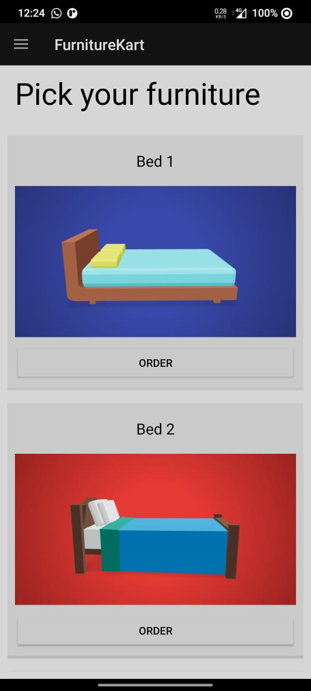
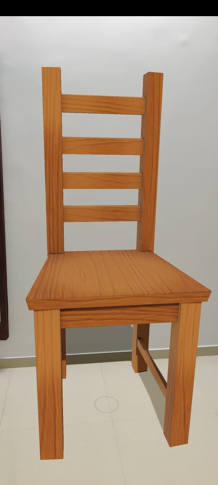
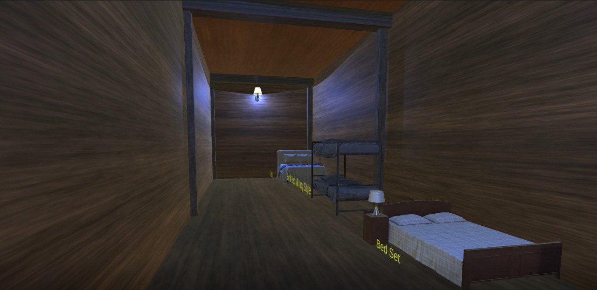
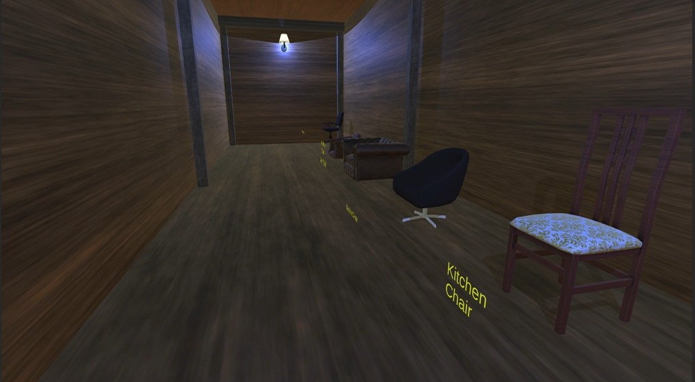
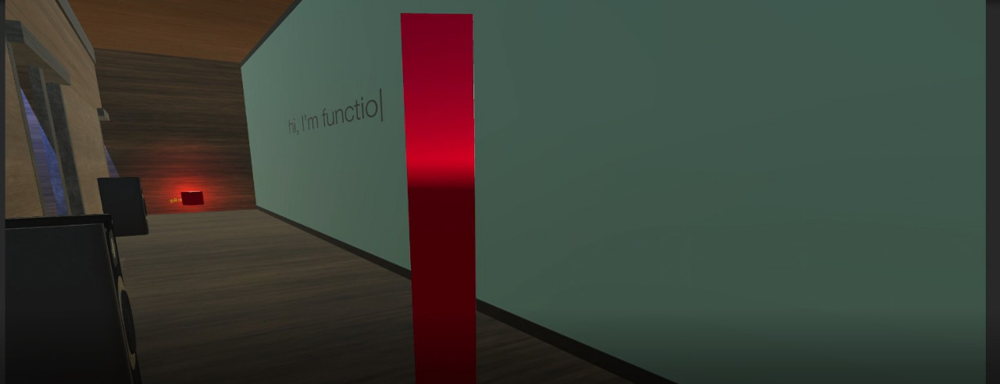
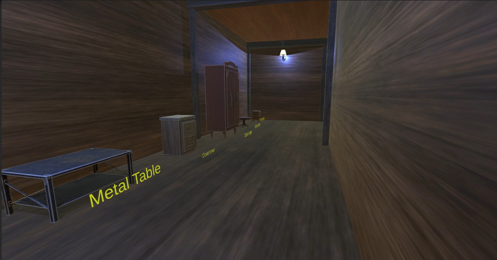

<div id="top"></div>

[![Contributors][contributors-shield]][contributors-url]
[![Forks][forks-shield]][forks-url]
[![Stargazers][stars-shield]][stars-url]
[![Issues][issues-shield]][issues-url]
[][license-url]

<!-- PROJECT LOGO -->
<br />
<div align="center">
  <a href="https://github.com/Vaasuawesome7/ARVRFurnitureKart">
    
  </a>

<h3 align="center">ARVR Furniture Cart</h3>

  <p align="center">
    An immersive VR and AR shopping experience!!
    <br />
    <a href="https://github.com/Vaasuawesome7/ARVRFurnitureKart"><strong>Explore the docs »</strong></a>
    <br />
    <br />
    <a href="https://youtu.be/MAuzC5ZtdZg">View Demo</a>
    ·
    <a href="https://github.com/Vaasuawesome7/ARVRFurnitureKart/issues">Report Bug</a>
    ·
    <a href="https://github.com/Vaasuawesome7/ARVRFurnitureKart/issues">Request Feature</a>
  </p>
</div>

<!-- TABLE OF CONTENTS -->
<details>
  <summary>Table of Contents</summary>
  <ol>
    <li>
      <a href="#about-the-project">About The Project</a>
      <ul>
        <li><a href="#built-with">Built With</a></li>
      </ul>
    </li>
    <li>
      <a href="#getting-started">Getting Started</a>
      <ul>
        <li><a href="#prerequisites">Prerequisites</a></li>
        <li><a href="#installation">Installation</a></li>
      </ul>
    </li>
    <li><a href="#usage">Usage</a></li>
    <li><a href="#roadmap">Roadmap</a></li>
    <li><a href="#contributing">Contributing</a></li>
    <li><a href="#license">License</a></li>
    <li><a href="#contact">Contact</a></li>
    <li><a href="#acknowledgments">Acknowledgments</a></li>
  </ol>
</details>

<!-- ABOUT THE PROJECT -->

## About The Project

[![Product Name Screen Shot][product-screenshot]](https://example.com)

[![Product Flow Screen Shot][product-flow]](https://example.com)

While most online shopping platforms are websites or applications there are few platforms which recreate the actual shopping experience through VR. 

Our platform takes it one step further and not only models the shop environment exactly as in reality right from store arrangement based on different product categories all the way up to online billing , but also has additional features such as personal shopping assistant that can point to useful links online , audio to provide information about products being browsed.

In addition to this we also have an AR app , which allows the user to place a product they have chosen in pictures of their home taken through a camera to help them make better choices. 
<p align="right">(<a href="#top">back to top</a>)</p>

### Built With

- [Unity](https://unity.com/)
- [ARCore](https://developers.google.com/ar)
- [C#](https://docs.microsoft.com/en-us/dotnet/csharp/)
- [Kotlin](https://kotlinlang.org/)

<p align="right">(<a href="#top">back to top</a>)</p>

<!-- GETTING STARTED -->

## Getting Started

### Installation

1. Clone the repo
   ```sh
   git clone https://github.com/Vaasuawesome7/ARVRFurnitureKart.git
   ```
2. Open Android Studio and open a project from Version Control.

3. Paste the URL and store it on a folder of your choice

4. Let the Gradle get synced and switch the branch to AR-app

<p align="right">(<a href="#top">back to top</a>)</p>

<!-- USAGE EXAMPLES -->

## Screenshots

### AR




### VR






_For more examples, please refer to the [Documentation](https://example.com)_

<p align="right">(<a href="#top">back to top</a>)</p>

<!-- CONTRIBUTING -->

## Contributing

Contributions are what make the open source community such an amazing place to learn, inspire, and create. Any contributions you make are **greatly appreciated**.

If you have a suggestion that would make this better, please fork the repo and create a pull request. You can also simply open an issue with the tag "enhancement".
Don't forget to give the project a star! Thanks again!

1. Fork the Project
2. Create your Feature Branch (`git checkout -b feature/AmazingFeature`)
3. Commit your Changes (`git commit -m 'Add some AmazingFeature'`)
4. Push to the Branch (`git push origin feature/AmazingFeature`)
5. Open a Pull Request

<p align="right">(<a href="#top">back to top</a>)</p>

<!-- LICENSE -->

## License

Distributed under the MIT License. See `LICENSE.txt` for more information.

<p align="right">(<a href="#top">back to top</a>)</p>

<!-- CONTACT -->

## Contact

Vaasu Gambhir - vaasugambhir@gmail.com@vaasugambhir@gmail.com_client.com

Project Link: [https://github.com/Vaasuawesome7/ARVRFurnitureKart](https://github.com/Vaasuawesome7/ARVRFurnitureKart)

<p align="right">(<a href="#top">back to top</a>)</p>

<!-- MARKDOWN LINKS & IMAGES -->
<!-- https://www.markdownguide.org/basic-syntax/#reference-style-links -->

[contributors-shield]: https://img.shields.io/github/contributors/Vaasuawesome7/ARVRFurnitureKart.svg?style=for-the-badge
[contributors-url]: https://github.com/Vaasuawesome7/ARVRFurnitureKart/graphs/contributors
[forks-shield]: https://img.shields.io/github/forks/Vaasuawesome7/ARVRFurnitureKart.svg?style=for-the-badge
[forks-url]: https://github.com/Vaasuawesome7/ARVRFurnitureKart/network/members
[stars-shield]: https://img.shields.io/github/stars/Vaasuawesome7/ARVRFurnitureKart.svg?style=for-the-badge
[stars-url]: https://github.com/Vaasuawesome7/ARVRFurnitureKart/stargazers
[issues-shield]: https://img.shields.io/github/issues/Vaasuawesome7/ARVRFurnitureKart.svg?style=for-the-badge
[issues-url]: https://github.com/Vaasuawesome7/ARVRFurnitureKart/issues
[license-shield]: https://img.shields.io/github/license/Vaasuawesome7/ARVRFurnitureKart.svg?style=for-the-badge
[license-url]: https://github.com/Vaasuawesome7/ARVRFurnitureKart/blob/main/LICENSE.txt
[linkedin-shield]: https://img.shields.io/badge/-LinkedIn-black.svg?style=for-the-badge&logo=linkedin&colorB=555
[product-screenshot]: images/main.png
[product-flow]: images/flow.png
